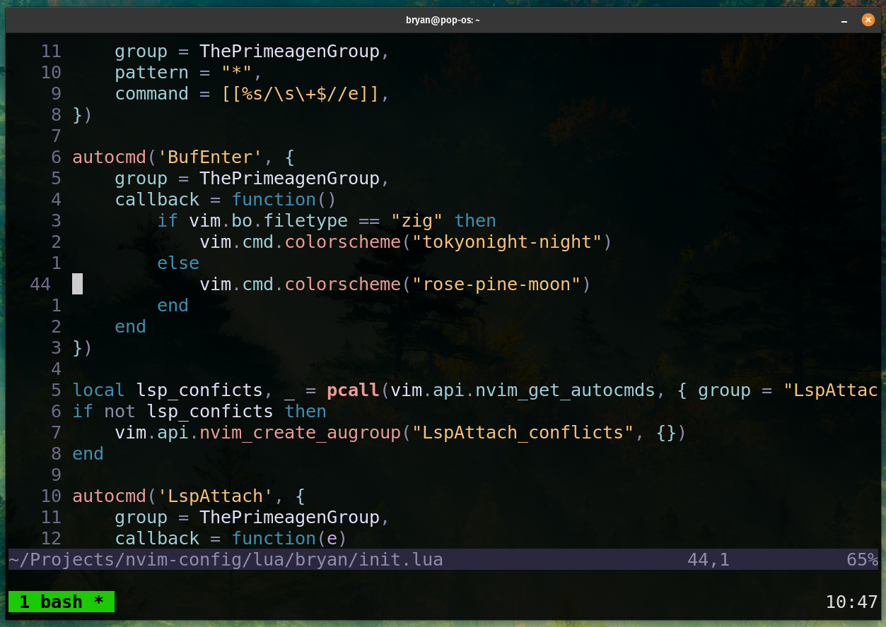

# Neovim Configuration ⚡

A modern Neovim setup optimized for my development workflow, inspired by ThePrimeagen's configuration patterns.



## Features ✨

- **Lightning-fast navigation** with Harpoon and Telescope
- **Smart LSP integration** for code intelligence
- **Enhanced syntax highlighting** with Treesitter
- **Git integration** with Fugitive
- **Diagnostics** with Trouble.nvim
- **Snippet engine** for rapid coding
- **Testing framework** integration via Neotest
- **Undo history visualization** with Undotree
- **Text manipulation** with Surround.nvim

## Prerequisites 🛠️

- Neovim (v0.11+ recommended)
- [ripgrep](https://github.com/BurntSushi/ripgrep) (`brew install ripgrep` or `sudo apt install ripgrep`)
- Lua 5.1 (`sudo apt install lua5.1` or equivalent for your OS)
- Luarocks (`sudo apt install luarocks` or equivalent)

## Installation ⚡

1. **Backup existing config** (if any):
   ```sh
   mv ~/.config/nvim ~/.config/nvim.bak
   ```

2. **Clone repository**:
   ```sh
   git clone https://github.com/Bryan07312002/nvim-config.git ~/.config/nvim
   ```

3. **Start Neovim** and let Lazy install plugins:
   ```sh
   nvim
   ```

## Plugin Ecosystem 🧩

### Core Plugins
| Plugin File         | Description                                  |
|---------------------|----------------------------------------------|
| `harpoon.lua`       | Rapid file navigation                        |
| `telescope.lua`     | Fuzzy finder for files/grep/help             |
| `lsp.lua`           | Language Server Protocol configuration       |
| `treesitter.lua`    | Advanced syntax parsing                      |
| `trouble.lua`       | Beautiful diagnostics viewer                 |

### Productivity Boosters
| Plugin File         | Description                                  |
|---------------------|----------------------------------------------|
| `fugitive.lua`      | Git integration                              |
| `undotree.lua`      | Visual undo history                          |
| `surround.lua`      | Text object manipulation                     |
| `snippets.lua`      | Code snippet engine                          |
| `neotest.lua`       | Test framework integration                   |

## Key Bindings ⌨️

### Navigation
- `<leader>ff` - Find files (Telescope)
- `<leader>fw` - Find Word (Telescope)
- `<leader>ha` - Harpoon add file
- `<leader>hm` - Harpoon quick menu

### LSP
- `gd` - Goto definition
- `gr` - Goto references
- `K` - Hover documentation
- `<leader>fd` - Format document

### Utilities
- `<leader>u` - Toggle Undotree
- `<leader>tt` - Toggle Trouble.nvim

## Troubleshooting 🔧

If you get errors on first launch:
1. Run `:checkhealth` to diagnose issues
2. Ensure all prerequisites are installed
3. Run `:PackerSync` to install missing plugins
4. Update Neovim to latest version

---

**Inspired by** [ThePrimeagen's Neovim Setup](https://github.com/ThePrimeagen/init.lua)
